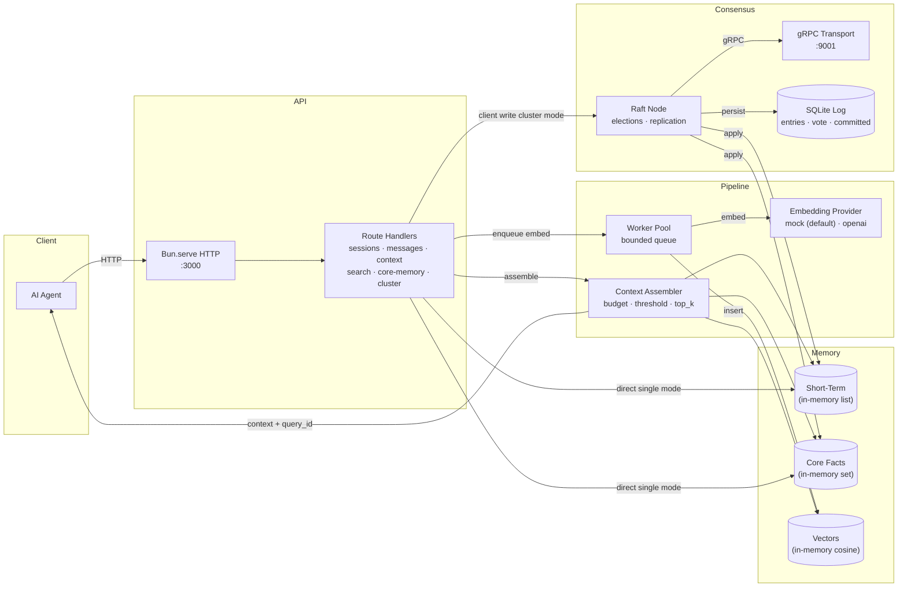

```
███████╗██╗   ██╗██████╗ ███████╗████████╗██████╗  █████╗ ████████╗███████╗
██╔════╝██║   ██║██╔══██╗██╔════╝╚══██╔══╝██╔══██╗██╔══██╗╚══██╔══╝██╔════╝
███████╗██║   ██║██████╔╝███████╗   ██║   ██████╔╝███████║   ██║   █████╗
╚════██║██║   ██║██╔══██╗╚════██║   ██║   ██╔══██╗██╔══██║   ██║   ██╔══╝
███████║╚██████╔╝██████╔╝███████║   ██║   ██║  ██║██║  ██║   ██║   ███████╗
╚══════╝ ╚═════╝ ╚═════╝ ╚══════╝   ╚═╝   ╚═╝  ╚═╝╚═╝  ╚═╝   ╚═╝   ╚══════╝
```

A distributed memory and retrieval system for AI agents built with Bun, TypeScript, and Turborepo. Uses short-term plus vector memory with a background embedding pipeline, token-budgeted context assembly, Raft consensus across a three-node cluster with a persistent SQLite log, and closes the loop with an Outcome Verification Layer that reweights memory from real-world results.

**Run:** API (`:3000`) · Cluster (`:3000 × 3` + gRPC `:9001 × 3`)

---

## Architecture



---

## Features

### Core Memory Engine
- **Sessions + Messages** — `POST /sessions` mints a `session_id` (optional `agent_id`). `POST /sessions/:id/messages` validates `role` plus `content` and returns `204`. Missing fields return `422`.
- **Core Facts** — `PUT /sessions/:id/core-memory` pins facts that never trim. Empty facts return `400`.
- **Pair-Safe Trim** — `stTrimToTokenBudget` drops `user + assistant` together, never orphaning an `assistant` line. Core facts are non-trimmable and always lead the context.
- **Dump + Restore** — Every store supports `dumpAll` plus `restoreAll` so snapshots capture the full state.

### Embeddings + Workers
- **Provider Trait** — `EmbeddingProvider` with `MockEmbeddingProvider` (deterministic hash vectors, default, zero cost) and `OpenAIEmbeddingProvider` (`text-embedding-3-small`, 429 retry with capped backoff). Switched by `EMBEDDING_PROVIDER`.
- **Bounded Queue + Pool** — `worker.ts` runs a configurable pool over a bounded channel. Full queues return `503`, duplicate ids skip, failures mark `failed` without a vector.
- **Accept-Then-Embed** — Message writes return `204` immediately. Vectors fill in the background, so write latency never waits on the embedding API.

### Context Assembly + Search
- **Budgeted Assembly** — `assembler.ts` orders `core facts → long-term hits → recent lines` inside `max_tokens`. Query picks the last `user` message, else the last line, else facts only.
- **Widened Search** — Vector lookup fetches `top_k × multiplier`, filters by `similarity_threshold`, and packs what fits the remaining budget. Every assembly mints a `query_id` for later feedback.
- **Validated Search** — `POST /sessions/:id/search` checks non-empty `query` and `top_k above zero` (`400` otherwise) and returns `memory_id plus text plus score` ranked best first.

### Consensus (Raft)
- **Three-Node Cluster** — Custom Raft core in `src/raft/` with randomized elections (300–550ms), 250ms heartbeats, majority commit, and per-peer `nextIndex` plus `matchIndex` with conflict backtracking.
- **Write Path** — With `NODE_ID` set, session, message, fact, and delete writes go through `clientWrite` (quorum) and apply on every node. Followers answer `307` with a `Location` header to the leader. No leader answers `503`. Without `NODE_ID`, writes apply directly (single mode).
- **Persistent Log** — `LogStore` keeps entries, vote, and commit index in SQLite (`RAFT_DB_PATH`). Purge never drops below the retention floor.
- **gRPC Transport** — `proto/raft.proto` defines `Vote`, `AppendEntries`, and `InstallSnapshot`. Runtime-loaded with proto-loader, no codegen step.

### Cluster Operations
- `GET /cluster` — Node id, role, leader id, term, applied index, members (`503` in single mode).
- `POST /cluster/init` — Mark the node initialized.
- `POST /cluster/add-learner` — Admit a peer allowlisted in `CLUSTER_PEERS` (`400` otherwise).
- `POST /cluster/change-membership` — Prune or add voters by id set.

### Outcome Verification Layer
- Every retrieval mints a `query_id`. Agents later post the real result against it, and learned scores reweight from facts instead of vibes. One failure becomes every agent's avoided pitfall. Under active build on top of the memory core.

### API
| Method | Path | Description |
|---|---|---|
| `POST` | `/sessions` | Create a session, returns `session_id` (optional `agent_id`) |
| `POST` | `/sessions/:id/messages` | Add a message, returns `204` (`422` on bad body) |
| `GET` | `/sessions/:id/context` | Assembled prompt plus `query_id` (`max_tokens`, `similarity_threshold`, `long_term_top_k`) |
| `POST` | `/sessions/:id/search` | Ranked vector hits (`query`, `top_k`) |
| `PUT` | `/sessions/:id/core-memory` | Pin a fact, returns `204` (`400` on empty fact) |
| `DELETE` | `/sessions/:id` | Delete a session, always `204` |
| `GET` | `/cluster` | Node status (`503` in single mode) |
| `POST` | `/cluster/init` | Mark initialized |
| `POST` | `/cluster/add-learner` | Admit a peer (`node_id`, `addr`) |
| `POST` | `/cluster/change-membership` | Set voter ids (`members`) |
| `GET` | `/health` | Empty `200` |

---

## Getting Started

### Prerequisites
- Bun 1.4+
- No database needed for single mode (in-memory stores, mock embeddings)

### Setup

```bash
# Install dependencies
bun install

# Build and type check the API
bun x turbo build --filter=api
bun x turbo check-types --filter=api
```

Single mode needs no environment. Cluster mode uses `apps/api/node*.env` files (see below).

### Start the API (single mode)

```bash
cd apps/api
bun src/index.ts
```

Serves HTTP on `:3000` with direct writes and mock embeddings.

### Start a Three-Node Cluster

Create `apps/api/node1.env`:
```
NODE_ID=1
PORT=3000
RAFT_ADDR=127.0.0.1:9001
RAFT_DB_PATH=./data/n1.redb
CLUSTER_PEERS=2:127.0.0.1:9002,3:127.0.0.1:9003
CLUSTER_HTTP_PEERS=1:http://localhost:3000,2:http://localhost:3001,3:http://localhost:3002
```

Create `node2.env` and `node3.env` with ids, ports (`3001`, `3002`), grpc ports (`9002`, `9003`), db paths, and mirrored peer lists. Then from repo root:

```bash
Start-Process -FilePath "bun" -ArgumentList "--env-file=node1.env src/index.ts" -WorkingDirectory "E:\workstuff\substrate\apps\api"
Start-Process -FilePath "bun" -ArgumentList "--env-file=node2.env src/index.ts" -WorkingDirectory "E:\workstuff\substrate\apps\api"
Start-Process -FilePath "bun" -ArgumentList "--env-file=node3.env src/index.ts" -WorkingDirectory "E:\workstuff\substrate\apps\api"
```

One node elects itself leader within a second. Writes to followers return `307`. Killing the leader triggers a new election among survivors.

### Environment

| Variable | Default | Description |
|---|---|---|
| `PORT` | `3000` | HTTP port |
| `NODE_ID` | _(unset)_ | Unset means single mode, set means cluster mode |
| `RAFT_ADDR` | _(unset)_ | gRPC bind address, e.g. `127.0.0.1:9001` |
| `RAFT_DB_PATH` | `./data/raft/substrate.redb` | SQLite Raft log file |
| `CLUSTER_PEERS` | _(empty)_ | Comma list `id:host:grpcPort` |
| `CLUSTER_HTTP_PEERS` | _(empty)_ | Comma list `id:httpUrl` for `307` targets |
| `REDIS_URL` | `redis://localhost:6379` | Reserved for Redis-backed stores |
| `LANCE_DB_PATH` | `./data/lancedb` | Reserved for LanceDB vectors |
| `EMBEDDING_PROVIDER` | `mock` | `mock` (free, offline) or `openai` (paid key) |
| `OPENAI_API_KEY` | _(empty)_ | Required only for `openai` provider |
| `OPENAI_BASE_URL` | `https://api.openai.com` | Override for compatible endpoints |
| `EMBEDDING_DIMENSION` | `1536` | Vector size, must match provider output |
| `EMBEDDING_MAX_CONCURRENCY` | `10` | Embed worker pool size |
| `MPSC_CHANNEL_SIZE` | `1000` | Bounded embed queue size |
| `SHORT_TERM_COUNT` | `20` | Cap for recent messages per session |
| `MAX_TOKENS_DEFAULT` | `8000` | Default context token budget |
| `SIMILARITY_THRESHOLD` | `0.7` | Default vector cutoff |
| `TOP_K_DEFAULT` | `10` | Default hit count |
| `RETRIEVAL_CANDIDATE_MULTIPLIER` | `2` | Widening factor before threshold |
| `RETRIEVAL_FEEDBACK_WEIGHT` | `1.0` | Learned-score weight (adaptive phase) |
| `RETRIEVAL_CONTEXT_TTL_SECS` | `300` | Query record expiry |

---

## Project Structure

```
substrate/
├── apps/
│   ├── api/                        # Bun HTTP API :3000 + Raft node
│   │   ├── proto/raft.proto        # Vote, AppendEntries, InstallSnapshot service
│   │   └── src/
│   │       ├── index.ts            # Bun.serve routes, write path, node startup
│   │       ├── types.ts            # Session, Message, search, context shapes
│   │       ├── store.ts            # Sessions map, contexts with TTL, facade
│   │       ├── stores/shortTerm.ts # List add, recent, count trim, pair budget trim
│   │       ├── stores/core.ts      # Fact add, list, dump, restore
│   │       ├── stores/vectors.ts   # Insert skip-if-exists, cosine search, dim check
│   │       ├── stores/index.ts     # Store exports
│   │       ├── tokens.ts           # TokenCounter trait plus simple counter
│   │       ├── config.ts           # Env defaults plus peer parsing
│   │       ├── errors.ts           # 400, 404, 422, 500, 503, 307 helpers
│   │       ├── embeddings.ts       # Mock plus OpenAI providers with retry
│   │       ├── worker.ts           # Bounded queue, pool, job lifecycle
│   │       ├── assembler.ts        # Budgeted context assembly plus query records
│   │       ├── cluster.ts          # Cluster routes, membership, redirect helpers
│   │       └── raft/
│   │           ├── types.ts        # NodeId, LogEntry, all 10 command variants
│   │           ├── logStore.ts     # SQLite log, vote, committed, floored purge
│   │           ├── stateMachine.ts # applyCommand to stores plus job fan out
│   │           ├── consensus.ts    # Elections, heartbeats, replication, commit
│   │           ├── network.ts      # Per-peer gRPC client via proto loader
│   │           └── grpcServer.ts   # Vote plus append plus install handlers
│   ├── web/                        # Turborepo Next.js stub app
│   └── docs/                       # Turborepo Next.js stub app
├── packages/
│   ├── typescript-config/          # Shared tsconfigs
│   ├── eslint-config/              # Shared eslint configs
│   └── ui/                         # Shared React stub library
└── turbo.json                      # build/check-types/dev pipelines
```

---

## API Documentation

### `POST /sessions`

```bash
curl -X POST http://localhost:3000/sessions \
  -H "Content-Type: application/json" \
  -d '{"agent_id": "agent-1"}'
```

**Response (200)**
```json
{
  "session_id": "6c7fafea-d93b-448d-a735-6e41f1de3d0f"
}
```

### `POST /sessions/:id/messages`

```bash
curl -X POST http://localhost:3000/sessions/6c7fafea-d93b-448d-a735-6e41f1de3d0f/messages \
  -H "Content-Type: application/json" \
  -d '{"role": "user", "content": "hello leader"}'
```

**Response:** `204` empty. Missing `role` or `content` returns `422`. Full queue returns `503`. Followers return `307` with a `Location` header.

### `GET /sessions/:id/context`

```bash
curl "http://localhost:3000/sessions/6c7fafea-d93b-448d-a735-6e41f1de3d0f/context?max_tokens=8000&similarity_threshold=0.7&long_term_top_k=10"
```

**Response (200)**
```json
{
  "context": "Fact: likes tea\nMemory: hello leader\nuser: hello leader",
  "query_id": "56c44ad3-8e28-4171-b92d-c48e71ad81d7"
}
```

Bad query values return `400`. Unknown sessions return `404`.

### `POST /sessions/:id/search`

```bash
curl -X POST http://localhost:3000/sessions/6c7fafea-d93b-448d-a735-6e41f1de3d0f/search \
  -H "Content-Type: application/json" \
  -d '{"query": "hello", "top_k": 5}'
```

**Response (200)**
```json
{
  "results": [
    { "memory_id": "e81633e7-8bc8-49cf-a25f-b6dea6d75afe", "text": "hello leader", "score": 0.85 }
  ]
}
```

Empty `query` or `top_k` below 1 returns `400`.

### `PUT /sessions/:id/core-memory`

```bash
curl -X PUT http://localhost:3000/sessions/6c7fafea-d93b-448d-a735-6e41f1de3d0f/core-memory \
  -H "Content-Type: application/json" \
  -d '{"fact": "likes tea"}'
```

**Response:** `204` empty. Empty facts return `400`.

### `DELETE /sessions/:id`

```bash
curl -X DELETE http://localhost:3000/sessions/6c7fafea-d93b-448d-a735-6e41f1de3d0f
```

**Response:** `204`, always, idempotent.

### `GET /cluster`

```bash
curl http://localhost:3000/cluster
```

**Response (200, cluster mode)**
```json
{
  "node_id": 1,
  "role": "leader",
  "leader_id": 1,
  "term": 1,
  "last_applied_index": 1,
  "members": [{ "id": 2, "addr": "127.0.0.1:9002" }]
}
```

Single mode returns `503`.

### `GET /health`

```bash
curl -i http://localhost:3000/health
```

**Response:** `200` empty.

---

## Write Lifecycle

```
client → leader → append log → replicate (majority) → commit → apply → respond
                ↘ follower → 307 redirect to leader
                ↘ no leader → 503
```

- **Single mode** — Routes write stores directly, no consensus involved.
- **Cluster mode** — `RegisterSession`, `AddMessage`, `AddFact`, and `DeleteSession` replicate before responding. Followers never apply uncommitted entries.
- **Failover** — Two of three voters elect a new leader automatically. The survivor pair keeps serving writes.
- **Durability** — Every committed entry sits in SQLite before it applies. Startup replay plus snapshots land next.

---

## License

MIT
